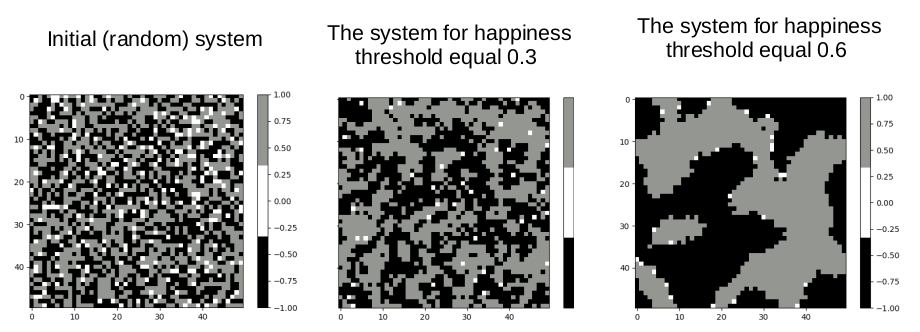

# Schelling model - urban segregation

# General info
The Schelling model presents urban segregation. We consider the square *L x L* and two types of agens (different ethically). Simulation:
* initialize the system: square(L,L) and equally with two types of people
* we check *happines* of all agents and agent is happy when number of all neighbours by number of neighbours the same type is smaller than happiness threshold (e. g. T = 0.3). Additionally, we consider boundary conditions for square lattice.
* if agent is unhappy we change his location to randomly chosen place

# Results

  

Nobody prefers total segregation (examples for 30% and 60%) but for this conditions we see spatial segregation. We can describe this as a macro-results from micro-behavior.

# Run
schelling.py make initial state of *city* (before.png) and return its state after simulation (after.png)

# Technologies
main.py is created with Python 3.7 and:
* NumPy
* Matplotlib
