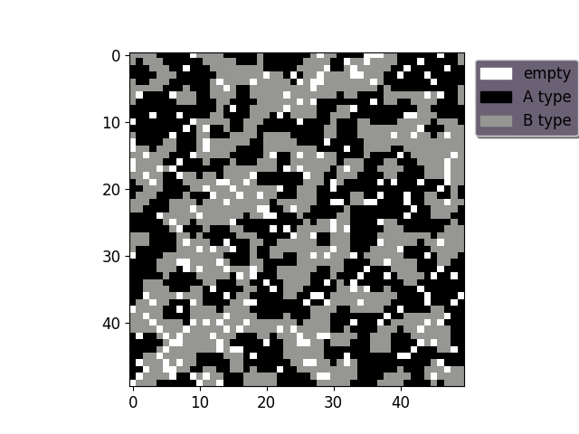
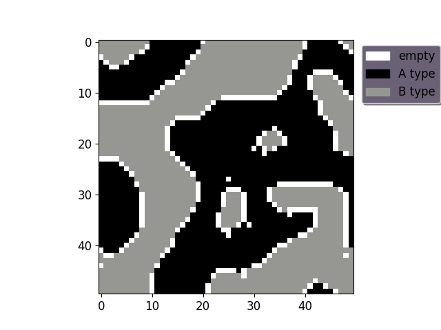

# Schelling model - urban segregation

# General info
The Schelling model presents the mechanism of urban segregation. We consider the square lattice with two types of agens (e.g. ethnic groups). Simulation:
* initialize the system: square lattice and each site is equally ones of two types
* we check *happines* of all agents and agent is happy when number of all neighbours by number of neighbours the same type is smaller than happiness threshold. Additionally, we consider boundary conditions for square lattice.
* if agent is unhappy we change his location to randomly chosen empty place
* ***One Monte Carlo Step*** is iteration over each lattice sites

# Results
Examples of results (averaged over 10^3 trials): for density of people 90% and consecutively, happiness threshold: 30% and 60%

  
  

Nobody prefers total segregation (examples for 30% and 60%) but for this conditions we see spatial segregation. We can describe this as a macro-results from micro-behavior.

# Motivation
* e.g. segregation in US cities

# Run
schelling.py make initial state of *city* and return its state after simulation

# Technologies
Project is created with Python 3.7 and:
* NumPy
* Matplotlib
